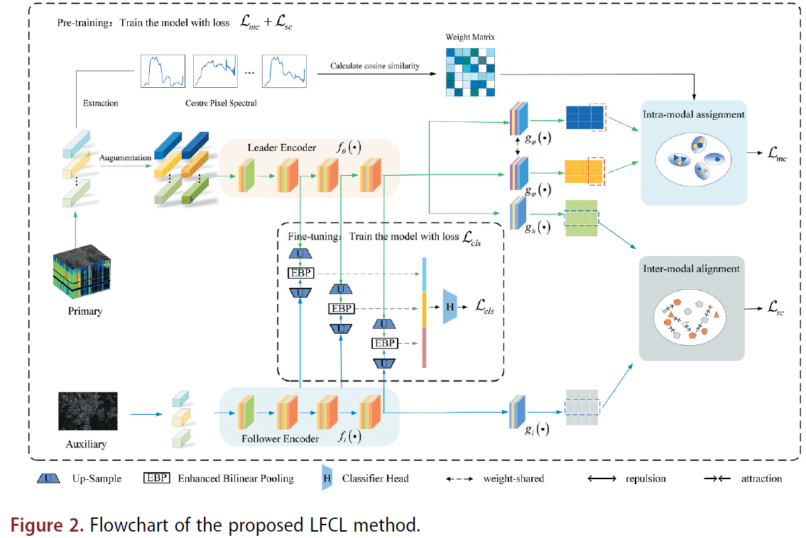

# LFCL
The code implements the "A Leader-Follower Contrastive Learning Framework for imbalanced Multimodal Remote Sensing Image Classification"

### Hyperspectral Image Classification With Contrastive Self-Supervised Learning Under Limited Labeled Samples

<font color='#88CDF6'> Jia Li, Lin Zhao*, Ping Tan, Minhui Zhao, Guoyun Zhang & Xinping Li</font>

<hr>
The code in this toolbox implements the

["A Leader-Follower Contrastive Learning Framework for imbalanced Multimodal Remote Sensing Image Classification"](https://www.tandfonline.com/doi/full/10.1080/01431161.2025.2513561)

More specifically, it is detailed as follow.




### System-Spefic notes:

The experimental computer setup includes an Intel(R)
Core(TM) i7-10700F processor, an NVIDIA GeForce RTX 2060 SUPER graphics card, and Python version 3.8.5 and PyTorch version 1.7.1 as the programming language and deep
learning platform, respectively.

<hr>

### How to use it?
First, running the `pretrain_main.py` to pretrain the model, This operation will get a weight folder. Running the `finetune.py` then, you will achieve the final results.


<hr>

### Citation
**Please kindly cite the papers if this code is useful and helpful for your research.**
```
@article{li2025leader,
  title={A leader-follower contrastive learning framework for imbalanced multimodal remote sensing image classification},
  author={Li, Jia and Zhao, Lin and Tan, Ping and Zhao, Minhui and Zhang, Guoyun and Li, Xinping},
  journal={International Journal of Remote Sensing},
  pages={1--28},
  year={2025},
  publisher={Taylor \& Francis}
}
```
<hr>

### Licensing
Copyright (C) 2022 Lin Zhao

This program is distributed in the hope that it will be useful, but WITHOUT ANY WARRANTY; without even the implied warranty of MERCHANTABILITY or FITNESS FOR A PARTICULAR PURPOSE. See the GNU General Public License for more details.

You should have received a copy of the GNU General Public License along with this program.


